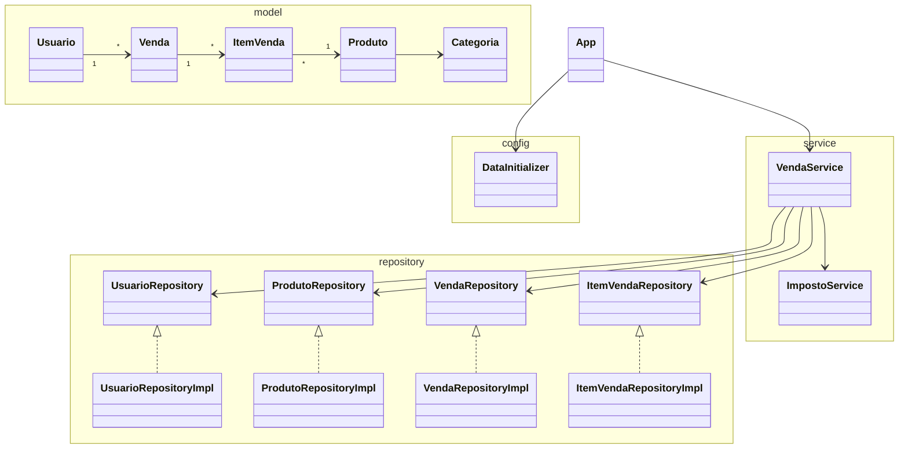

```mermaid
classDiagram

%% =========================
%% CONFIG
%% =========================
namespace config {
    class DataInitializer
}

%% =========================
%% MODEL (DOMAIN)
%% =========================
namespace model {
    class Usuario
    class Produto
    class Categoria
    class Venda
    class ItemVenda
}

%% =========================
%% REPOSITORY
%% =========================
namespace repository {
    class UsuarioRepository
    class UsuarioRepositoryImpl
    class ProdutoRepository
    class ProdutoRepositoryImpl
    class VendaRepository
    class VendaRepositoryImpl
    class ItemVendaRepository
    class ItemVendaRepositoryImpl
}

%% =========================
%% SERVICE
%% =========================
namespace service {
    class VendaService
    class ImpostoService
}

%% =========================
%% APP
%% =========================
class App

%% =========================
%% RELAÇÕES DOMAIN
%% =========================
Usuario "1" --> "*" Venda
Venda "1" --> "*" ItemVenda
ItemVenda "*" --> "1" Produto
Produto --> Categoria

%% =========================
%% SERVICE -> REPOSITORY
%% =========================
VendaService --> VendaRepository
VendaService --> ItemVendaRepository
VendaService --> ProdutoRepository
VendaService --> UsuarioRepository
VendaService --> ImpostoService

%% =========================
%% REPOSITORY IMPLEMENTAÇÃO
%% =========================
UsuarioRepository <|.. UsuarioRepositoryImpl
ProdutoRepository <|.. ProdutoRepositoryImpl
VendaRepository <|.. VendaRepositoryImpl
ItemVendaRepository <|.. ItemVendaRepositoryImpl

%% =========================
%% APP
%% =========================
App --> VendaService
App --> DataInitializer
```
