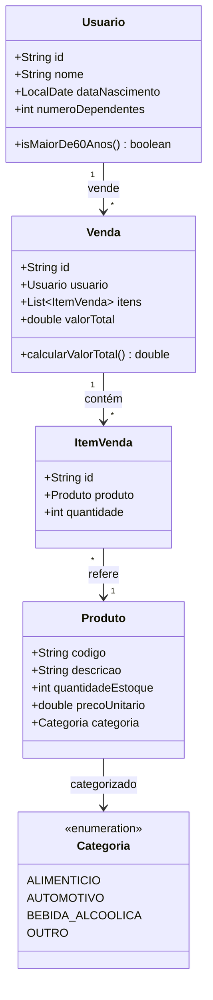

```mermaid
classDiagram
    class Usuario {
        +String id
        +String nome
        +LocalDate dataNascimento
        +int numeroDependentes
        +isMaiorDe60Anos() boolean
    }

    class Produto {
        +String codigo
        +String descricao
        +int quantidadeEstoque
        +double precoUnitario
        +Categoria categoria
    }

    class Categoria {
        <<enumeration>>
        ALIMENTICIO
        AUTOMOTIVO
        BEBIDA_ALCOOLICA
        OUTRO
    }

    class Venda {
        +String id
        +Usuario usuario
        +List~ItemVenda~ itens
        +double valorTotal
        +calcularValorTotal() double
    }

    class ItemVenda {
        +String id
        +Produto produto
        +int quantidade
    }

    Usuario "1" --> "*" Venda : vende
    Venda "1" --> "*" ItemVenda : contém
    ItemVenda "*" --> "1" Produto : refere
    Produto --> Categoria : categorizado
```
